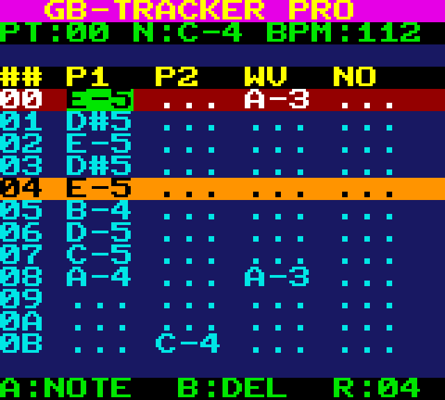
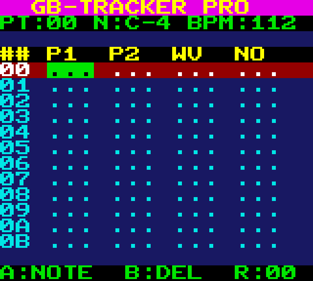
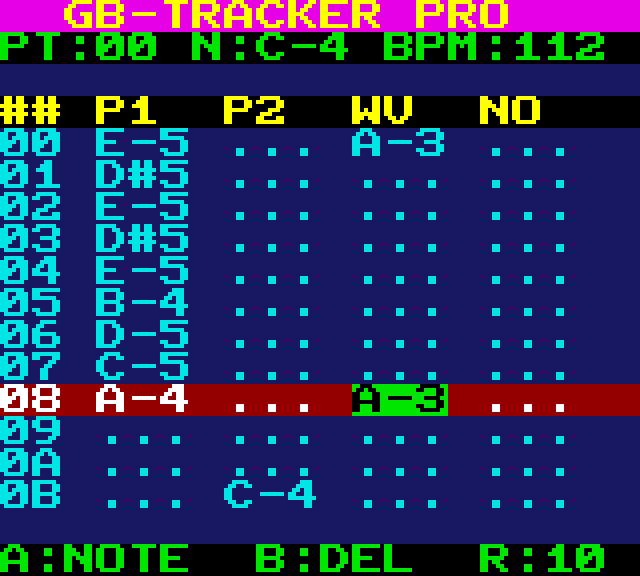
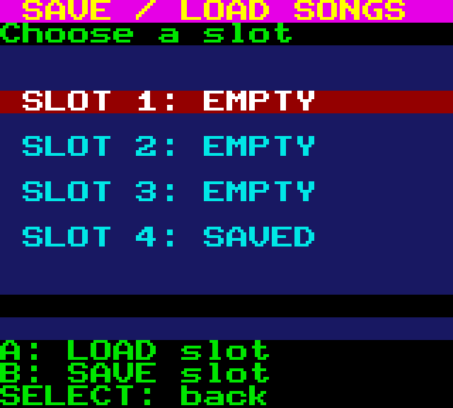
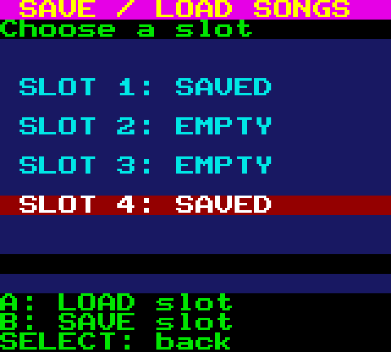
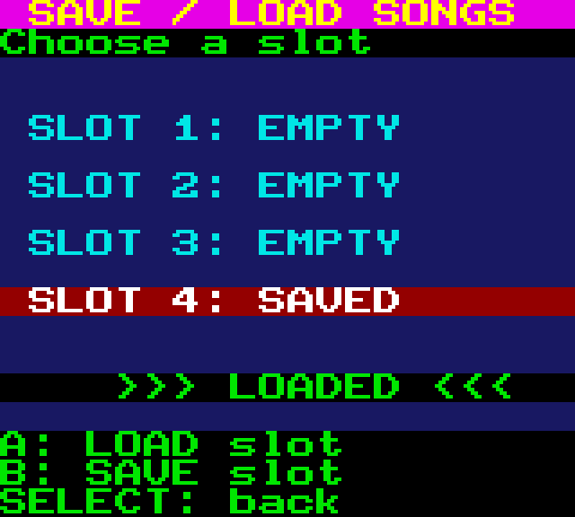

<div align="center">

# GB-TRACKER PRO

**A 4-channel music tracker for the Game Boy Color**



[](LICENSE)
[](https://en.wikipedia.org/wiki/Game_Boy_Color)
[](https://rgbds.gbdev.io/)
[](#)

</div>

A FastTracker-styled pattern editor that fits in **32 KB of ROM** and runs on real Game Boy Color hardware or any CGB-accurate emulator (BGB, SameBoy, mGBA, binjgb). All 4 hardware audio channels, 8 CGB palettes, and 32 KB of battery-backed SRAM for song slots are used in full.

---

## Features

- **4-channel audio engine** driven from the VBlank interrupt — Pulse 1 / Pulse 2 / Wave (PCM 32-sample) / Noise (LFSR drums)
- **64 instruments across 3 banks**
  - 16 pulse profiles (duty + envelope combinations)
  - 32 wave preset PCM samples (Sine, Tri, Saw, Organ, EPiano, Brass, SubBass, FM, Pluck, …)
  - 16 drum-kit slots on the noise channel (Kick, Snare, ClHat, OpHat, Crash, Toms, Clap, …)
- **Pattern editor** — 4 patterns × 32 rows × 4 channels, cursor navigation, note stamping, instrument cycling
- **Order list** — sequence patterns to build full songs
- **BPM display** — computed live from tracker Speed (default ~112 BPM)
- **Save/Load to battery-backed SRAM** — 4 slots × 2 KB, each holds a complete song (4 patterns + order + speed)
- **Auto-format on first boot** with magic header `"FTGB"` for corruption recovery
- **Pre-installed demo cover** of Beethoven's _Für Elise_ in Slot 4 (public domain)
- **Flicker-free playback** — incremental attribute repaint inside the VBlank ISR, full pattern redraws are LCD-off and only triggered by input
- **Companion Python toolkit** ([`tools/fts_tool.py`](tools/fts_tool.py)) for extracting / injecting songs from `.sav` files dumped by flashcarts (EZ-Flash Junior, Everdrive, etc.)
- **Auto-generated screenshots** of the actual ROM rendering used by the manual ([`tools/render_screens.py`](tools/render_screens.py))

---

## Screenshots

| Boot (empty song) | Demo Per Elisa playing | Cursor on Wave channel |
| --- | --- | --- |
|  |  |  |

| Save/Load menu | Slot navigation | Save / Load toasts |
| --- | --- | --- |
|  |  |  |

The UI uses 8 CGB BG palettes for distinct color roles:

| Palette | Used for |
| --- | --- |
| **Navy / Cyan** | Pattern view background and notes |
| **Magenta / Yellow** | Title bar |
| **Green / Black** | Cursor cell highlight |
| **Dark Red / White** | Cursor row band |
| **Orange / Black** | Currently-playing row band |
| **Black / Yellow** | Column header |
| **Black / Green** | Status bar and help line |

---

## Controls

### Pattern editor

| Key (real GB) | Key (binjgb default) | Action |
| --- | --- | --- |
| `↑` `↓` | Arrow Up / Down | Move cursor row |
| `←` `→` | Arrow Left / Right | Move cursor channel (P1 / P2 / WV / NO) |
| `A` | `X` | Stamp the current note at the cursor cell, then auto-advance one row |
| `B` | `Z` | Erase the cell under the cursor |
| `Start` | `Enter` | Toggle play / pause |
| `Select` + `↑/↓` | `Tab` + Arrow Up/Down | Change current note up/down a semitone |
| `Select` + `←/→` | `Tab` + Arrow Left/Right | Cycle current instrument (1..16) |
| `Select` + `A` | `Tab` + `X` | Preview current note on cursor's channel |
| `Select` + `B` | `Tab` + `Z` | Switch to next pattern (0 → 1 → 2 → 3 → 0) |
| `Select` + `Start` | `Tab` + `Enter` | Open Save/Load menu |

### Save/Load menu

| Key | Action |
| --- | --- |
| `↑` `↓` | Move selection between 4 slots |
| `A` | Load the highlighted slot into memory (auto-restarts playback) |
| `B` | Save the current song into the highlighted slot (overwrites) |
| `Select` | Exit menu, return to pattern editor |

---

## The included demo: _Für Elise_

The famous opening phrase of Ludwig van Beethoven's _Bagatelle in A minor, WoO 59_ (c. 1810, public domain) is pre-loaded in **Slot 4** at first boot and auto-plays.

The arrangement uses **all 4 channels**:

| Pattern | Role | Instruments |
| --- | --- | --- |
| `0` | Phrase A (clean) | Pulse1: PianoSoft · Wave: SubBass (warm sine + 2nd/3rd harmonic) · no drums |
| `1` | Phrase A (with drum kit) | + Kick/Snare/ClHat pumping |
| `2` | Phrase B (C major bridge) | Wave switches to Organ |
| `3` | Outro | Arpeggio A-minor → final crash → note-off |

Order list: `0 → 1 → 0 → 2 → 0 → 3` · Speed `8` (~112 BPM in 2/4 with 1/16 grid).

---

## Building from source

> 📄 **Guida completa in italiano**: [GB_TRACKER_PRO_Guida_Sviluppo.pdf](GB_TRACKER_PRO_Guida_Sviluppo.pdf) — setup passo-passo dell'ambiente di sviluppo su **Windows** e **macOS** (RGBDS v1.0.1, Python, emulatori, troubleshooting).

### Requirements

- Python 3.8+ (only for the asset generators and the manual)
- [RGBDS](https://rgbds.gbdev.io/) v1.0.1+ (`rgbasm`, `rgblink`, `rgbfix`)
  - On Windows: drop `rgbasm.exe`, `rgblink.exe`, `rgbfix.exe`, `rgbgfx.exe` and the two DLLs in `tools/`
  - On macOS/Linux: `brew install rgbds` — `build.py` auto-detects RGBDS from `PATH` when `tools/*.exe` are absent

### One-command build

```bash
python build.py
```

The script:
1. Regenerates `src/font.asm`, `src/notes.asm`, `src/waves.asm` from Python
2. Assembles each `.asm` with `rgbasm`
3. Links with `rgblink`
4. Patches the cartridge header with `rgbfix` (CGB-only, MBC5 + RAM + battery)

Produces `GB_TRACKER_PRO.gbc` (32 KB).

### Regenerating the manual

```bash
python tools/render_screens.py     # rebuilds pixel-perfect PNGs of the UI
python tools/build_manual.py       # rebuilds the PDF
```

Produces `GB_TRACKER_PRO_Manual.pdf` (16 pages).

---

## Running on a real Game Boy Color

The ROM is a standard 32 KB **MBC5 + RAM + Battery** cartridge image. Drop `GB_TRACKER_PRO.gbc` onto any flashcart that supports MBC5:

- **EZ-Flash Junior** ✅
- **Everdrive GB** ✅
- **BennVenn ElCheapoSD** ✅
- **Krikzz / Bung GB-USB** ✅

Save files (`.sav`, 32 KB raw SRAM dump) are written to the flashcart's microSD automatically at power-off and survive cartridge unplugging.

### Managing songs with `fts_tool.py`

A Python CLI ([`tools/fts_tool.py`](tools/fts_tool.py)) lets you inspect and shuffle songs between `.sav` files and standalone `.fts` (FastTracker GB Song) files:

```bash
# What's inside a .sav from your flashcart?
python tools/fts_tool.py info  GB_TRACKER_PRO.sav

# Extract all populated slots as individual song files
python tools/fts_tool.py extract  GB_TRACKER_PRO.sav  ./my_songs/

# Inject someone else's song into Slot 2 of your save
python tools/fts_tool.py import  GB_TRACKER_PRO.sav  2  brano_di_marco.fts

# Wipe a slot
python tools/fts_tool.py clear  GB_TRACKER_PRO.sav  3

# Make a fresh empty save (e.g. for testing)
python tools/fts_tool.py blank  GB_TRACKER_PRO.sav
```

`.fts` files are self-contained 528-byte blobs that include all 4 patterns + order list + speed.

---

## Project layout

```
GB-TRACKER PRO/
├── src/
│   ├── header.asm        ROM cartridge header (CGB flag, MBC5 + battery)
│   ├── main.asm          Boot, init, main loop, VBlank ISR (incremental repaint)
│   ├── player.asm        Audio engine (PlayerTick, instrument triggers), demo song
│   ├── ui.asm            Pattern editor & save/load menu drawing
│   ├── input.asm         Joypad polling + key dispatch
│   ├── save.asm          SRAM format / save / load (magic "FTGB" v2)
│   ├── font.asm          (generated) 128-tile font
│   ├── notes.asm         (generated) 60-note period lookup tables
│   └── waves.asm         (generated) 32 wave-RAM presets
├── inc/
│   └── hardware.inc      GBC hardware register definitions
├── tools/
│   ├── gen_font.py       Pixel-font generator
│   ├── gen_notes.py      Note frequency tables
│   ├── gen_waves.py      Wave bank generator
│   ├── render_screens.py Pixel-perfect screenshot renderer
│   ├── build_manual.py   PDF manual generator
│   └── fts_tool.py       .sav / .fts manipulation CLI
├── manual/
│   └── screenshots/      Generated UI screenshots
├── build.py              One-shot build script
├── LICENSE               MIT
├── README.md             This file
├── GB_TRACKER_PRO.gbc    Built ROM (32 KB)
└── GB_TRACKER_PRO_Manual.pdf
```

---

## Architecture highlights

- **No double-speed mode** — runs at single-speed CGB clock for simpler joypad timing.
- **VBlank-driven everything** — the audio engine (`PlayerTick`) and the incremental UI repaint (`UI_RepaintPlayingBand`) both live inside the VBlank ISR so all VRAM writes happen inside the 4500-cycle safe window.
- **Full pattern redraws** (`UI_DrawPattern`) only fire on cursor/pattern change — input is rare, so the brief LCD-off blank is invisible.
- **Wave channel volume at 50 %** (`NR32 = $40`) to keep the bass behind the pulse leads.
- **MBC5 SRAM with magic header** — corruption recovery via auto-reformat + demo reinstall.

See [`GB_TRACKER_PRO_Manual.pdf`](GB_TRACKER_PRO_Manual.pdf) for the full user manual with section-by-section walkthrough.

---

## Credits

- **Code & arrangement**: Luigi Massari (with assistance from Claude Code)
- **Demo melody**: _Für Elise_ by Ludwig van Beethoven (public domain)
- **Toolchain**: [RGBDS](https://rgbds.gbdev.io/) by gbdev.io
- **Hardware reference**: [Pan Docs](https://gbdev.io/pandocs/)

Licensed under [MIT](LICENSE).
